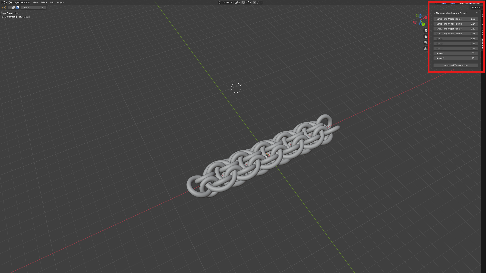

# Blender Parameterization Helper

## Overview

The purpose of this repository is to host a tool that will take blender code for parameterized modelling of chainmail weaves and return modified code that will model the weave in addition to adding a custom UI allowing you to modify the parameters from a UI and offer a keyboard control method.

Below is an example of the custom UI added to blender.

## Expected Code Format

As this program takes code as input, it expects the code to follow a certain layout to run smoothly. 

The script looks for headings to separate the sections it needs to read, `Imports`, `Parameters` and `Model Code`. Below are explainations of how to format section headings, and explainations of the two sections.

### Section Headings

Section headings should take the form of 3 comments on a group of three lines of the following format:

* The first line should be just hashes (`#`) the from the start to the length of the second line.

* The second line is comprised of three parts:
    * The first part is three hashes followed by a space (`### `).
    * The second part is the section name as a capitalized spaced string (`This Is My Section`).
    * The third part is a space followed by three hashes (` ###`).

* The third line should be just hashes (`#`) the from the start to the length of the second line.

An example section heading is:

    ####################
    ### Section Name ###
    ####################

### Imports

This section is for importing the libraries you use for your rough script.

### Parameters

This section is where you define the parameters you want added to the final script.

Parameters follow one of the two formats:
* `label = value`
    * Use this for normal numeric values.
* `label = math.radians(90)`
    * Use this for rotational values you want displayed as degrees instead of radians.

If you have a parameter with the label `name` the name will be used in the name of the custom toolbar.

### Model Code

This is where it is expected for you to put your code that uses the parameters to generate your model.

### Example Code

TODO

## Goals

* Write a standalone executable for windows
* Make a 1 page app hosted via GH pages
* Add support for variables composed of other variables

## Build Instructions

* Install Build Requirements:
    * `pip install requirements-build.txt`
* Run **Nuitka** to build application:
    * `python -m nuitka --enable-plugin=tk-inter --windows-console-mode=disable --remove-output --onefile tkinter_gui.py`
    * If you want to build multiple times to test/itterate I suggest removing `--remove-output`
    * If you want to debug the compiled application I suggest removing `--windows-console-mode=disable`
* (Optional) - Package for release by running the following command (linux/wsl):
    `zip <archive_name> tkinter_gui.exe assets/alert.wav`

## Credits

alert.wav, based on Metal Gear Solid Inspired Alert Surprise SFX by djlprojects -- https://freesound.org/s/413641/ -- License: Creative Commons 0
